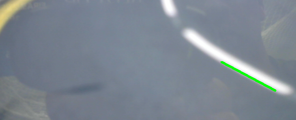

# 🚗 Road-Line-Detection-OpenCV


A lightweight **road line (lane boundary) detection** project built with **Python** and **OpenCV**.  
It focuses on detecting the **right lane boundary** (continuous or dashed white/yellow line) in **real-time** from a camera feed optimized for low-power devices like **Jetson Nano**.

---

## 🛠 Requirements
- Python 3.8+
- OpenCV ≥ 4.5
- NumPy

Install all requirements with:
```bash
pip install opencv-python numpy
```

---

## 🚀 How It Works
1. **Camera Input**  
   Captures frames from a webcam or CSI camera.

2. **Region of Interest (ROI)**  
   Crops only the lower-right area of the frame — where the road’s right boundary usually appears — reducing noise and CPU load.

3. **Color Filtering (HLS)**  
   Keeps only **white and yellow** tones corresponding to lane markings.

4. **Edge Detection (Canny)**  
   Finds high-contrast borders from the filtered mask.

5. **Line Extraction (Hough Transform)**  
   Detects straight segments inside the ROI and keeps the lowest (closest) one as the road-edge candidate.

6. **Visualization**  
   Draws the detected right-lane segment in **green** and displays intermediate masks for debugging.

---

## ▶️ Usage
1. Connect your camera (USB or CSI).
2. Run the script:
   ```bash
   python road_line_detection.py
   ```
3. Press **`q`** to quit.

Windows appear for:
- **Detección de línea del camino** → main frame with the detected line  
- **Máscara de color** → white/yellow filter result  
- **Bordes** → Canny edge map  

---

## ⚙️ Parameters to Tune
| Parameter | Default | Description |
|------------|----------|-------------|
| ROI height | 0.6 × H | Portion of the lower frame analyzed |
| Canny thresholds | 50 – 150 | Adjust for lighting conditions |
| Hough minLineLength | 40 px | Shortest segment accepted |
| Color thresholds | HLS white/yellow | Adapt to your lane paint |

---

## 💡 Notes
- Works best with a fixed forward-facing camera and visible road markings.  
- Designed as the **first perception stage** for autonomous or RC vehicles — can feed lane-keeping or path-planning modules.  
- Fully CPU-based; runs at 20–30 FPS on Jetson Nano.

---

## 📸 Example

